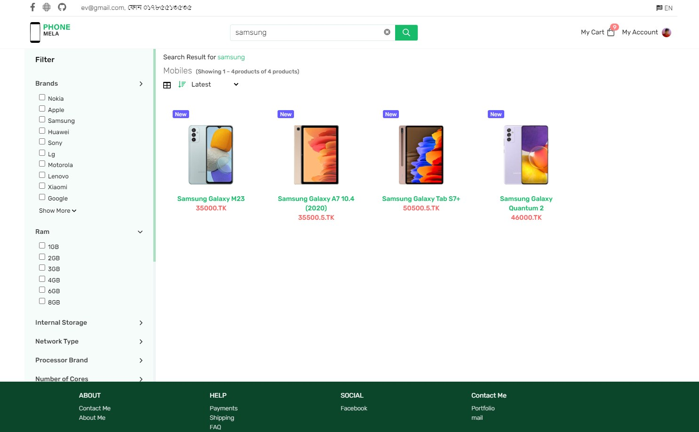
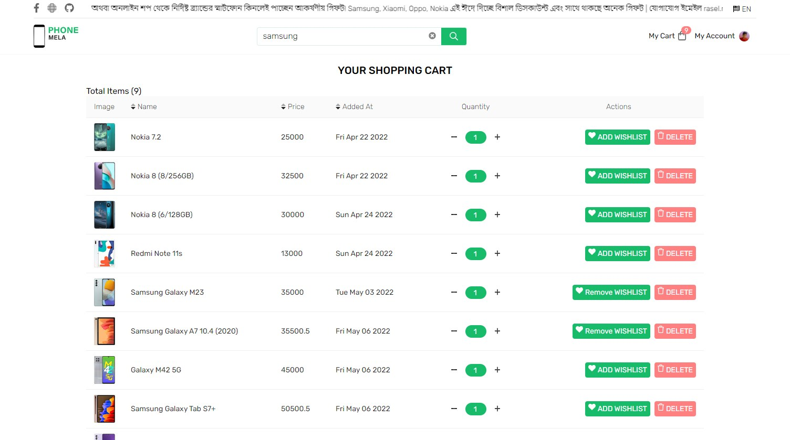
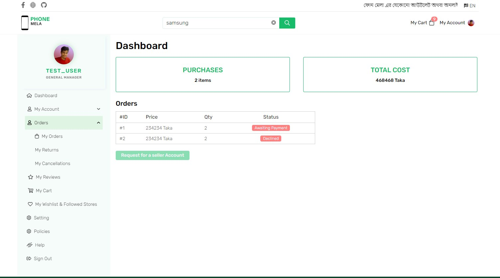
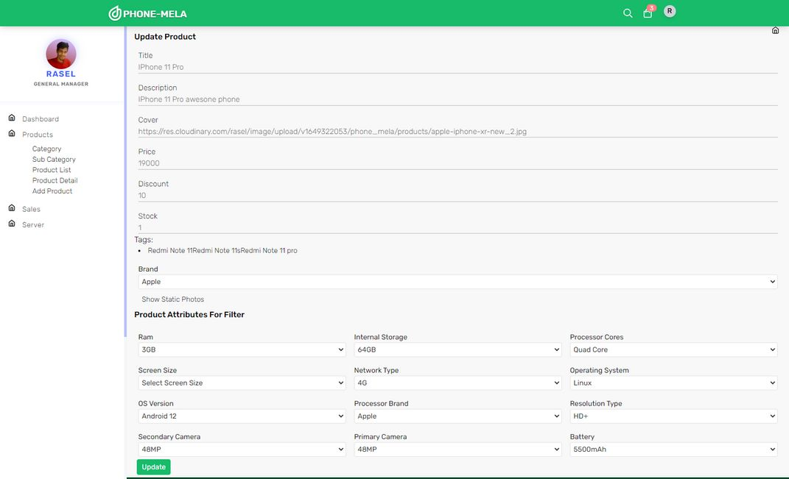

Phone Mela FullStack Ecommerce website, build with Golang, React js and MySQL


### API Endpoint Example
```go
    router.HandleFunc("/api/brands", controllers.FetchBrands).Methods("GET")
	router.HandleFunc("/api/products", controllers.FetchProducts).Methods("GET")
	router.HandleFunc("/api/product/{id}", controllers.FetchProduct).Methods("GET")
	router.HandleFunc("/api/sign-in", controllers.Login).Methods("POST")
	router.HandleFunc("/api/sign-current-user", middleware.IsAuth(controllers.LoginCurrentUser)).Methods("GET")
	router.HandleFunc("/api/filter-products", controllers.FilterProduct).Methods("POST")
	router.HandleFunc("/api/product", middleware.IsAuth(controllers.AddProduct)).Methods("POST")
	
```

# This Application under development 

Live Link https://phone-mela.vercel.app/

### Preview screenshot

#### Homepage


<br/>

#### Product Filter Page


<br/>

#### Carts Items



<br/>

####  Customer Dashboard



<br/>

####  Admin Dashboard Adding Product


