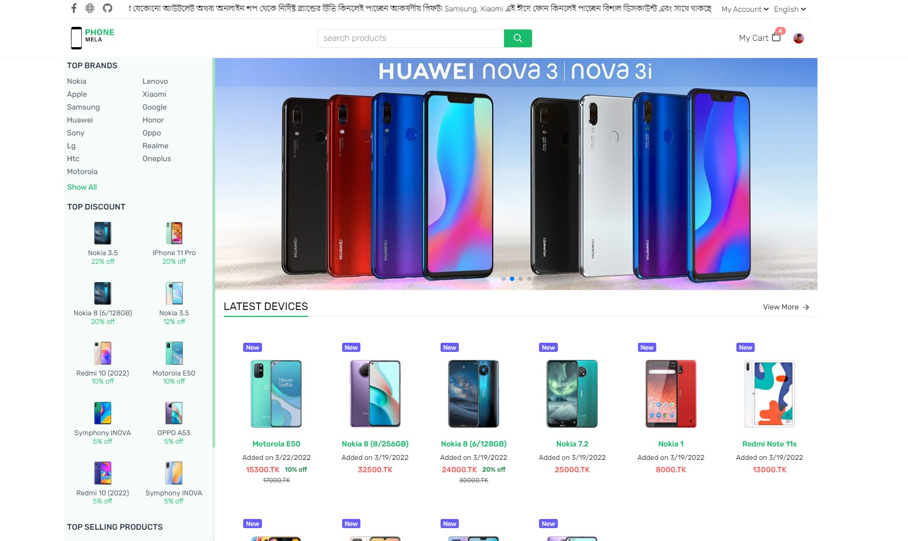

## Phone Mela fullstack ecommerce website, build with Nodejs, React js and MySQL/Mongodb


### Nodejs + Mongodb API Endpoint Example
I haven't MYSQL database hosting. I cannot host my go app over the internet.
So I create nodejs + mongodb version this api server to free live on netlify.

```js

const productRoutes = (app: Application)=> {
	app.get("/api/products", controllers.productController.fetchProducts)
	app.post("/api/homepage-products", controllers.productController.fetchHomePageProducts)
	app.post("/api/top-wishlist-products", controllers.productController.topWishlistProducts)
	app.post("/api/add-product", admin, controllers.productController.addProduct)
}
const authRoutes = (app: Application)=> {		
	app.post("/api/signup", controllers.authController.userRegistration)
	app.post("/api/sign-in", controllers.authController.login)
	app.get("/api/sign-current-user", controllers.authController.loginCurrentUser)
}
const orderRoutes = (app: Application)=> {		
	app.post("/api/order", controllers.orderController.createOrder)
	app.post("/api/orders", controllers.orderController.fetchOrders)
	app.get("/api/order/:orderId", controllers.orderController.fetchOrder)
}
const wishlistRoutes = (app: Application)=> {
	app.post("/api/wishlist-products", auth, controllers.wishlistController.fetchWishlistProducts)
	app.post("/api/add-wishlist", auth, controllers.wishlistController.addToWishlist)	  
	app.post("/api/remove-wishlist", auth, controllers.wishlistController.removeToWishlist)
}
const shippingAddressRoutes = (app: Application)=> {
	app.get("/api/shipping-addresses/:customer_id", auth, controllers.shippingAddressController.getShippingAddress)
	app.post("/api/shipping-address", auth, controllers.shippingAddressController.addShippingAddress)
}
const cartRoutes = (app: Application)=> {		
	app.post("/api/cart-products", auth, controllers.cartController.fetchCartProducts)
	app.post("/api/add-cart", auth, controllers.cartController.addToCart)
	app.post("/api/remove-cart", auth, controllers.cartController.removeToCart)
}
// and much more routing
```


# This Application under development 

Live Link https://phone-mela.vercel.app/

### Preview screenshot

#### Homepage


<br/>

#### Product Filter Page


<br/>

#### Carts Items


<br/>

####  Customer Dashboard


<br/>

####  Admin Dashboard Adding Product


