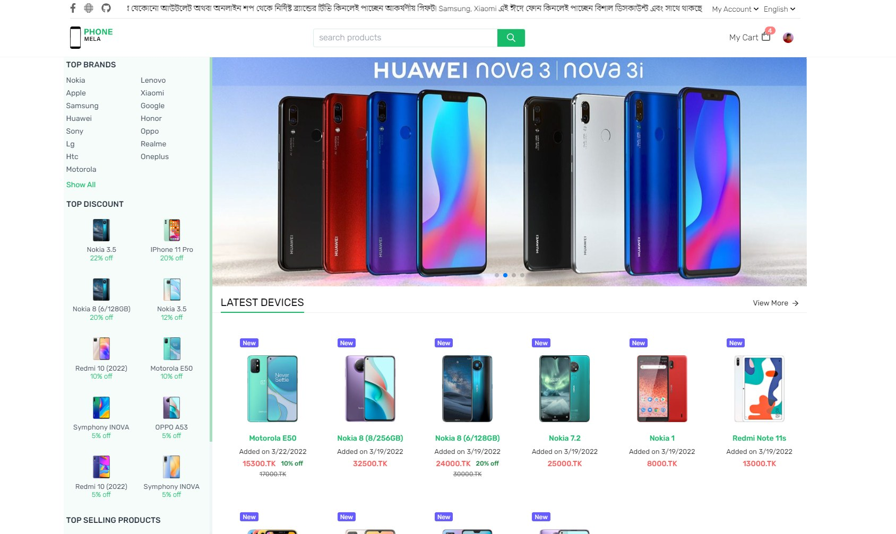

Mobile Shop Ecommerce website, build with Golang and React js


### API Endpoint
```go
    router.HandleFunc("/api/brands", controllers.FetchBrands).Methods("GET")
	router.HandleFunc("/api/products", controllers.FetchProducts).Methods("GET")
	router.HandleFunc("/api/product/{id}", controllers.FetchProduct).Methods("GET")
	router.HandleFunc("/api/sign-in", controllers.Login).Methods("POST")
	router.HandleFunc("/api/sign-current-user", middleware.IsAuth(controllers.LoginCurrentUser)).Methods("GET")
	router.HandleFunc("/api/filter-products", controllers.FilterProduct).Methods("POST")
	router.HandleFunc("/api/product", middleware.IsAuth(controllers.AddProduct)).Methods("POST")
	
```

## This Application under development

[Live Link]("https://phone-mela.vercel.app")
### Preview screenshot




[comment]: <> ([{"label":"Network","props":{"Speed":"HSPA 42.2/5.76 Mbps, LTE ","2G bands":"GSM 850 / 900 / 1800 / 1900 - SIM 1 & SIM 2","3G bands":"HSDPA 850 / 900 / 2100","4G bands":"LTE band 1&#40;2100&#41;, 2&#40;1900&#41;, 3&#40;1800&#41;, 4&#40;1700/2100&#41;, 5&#40;850&#41;, 7&#40;2600&#41;, 8&#40;900&#41;, 11&#40;1500&#41;, 12&#40;700&#41;, 13&#40;700&#41;, 17&#40;700&#41;, 18&#40;800&#41;, 19&#40;800&#41;, 20&#40;800&#41;, 21&#40;1500&#41;, 25&#40;1900&#41;, 26&#40;850&#41;, 28&#40;700&#41;, 29&#40;700&#41;, 30&#40;2300&#41;, 32&#40;1500&#41;, 34&#40;2000&#41;, 38&#40;2600&#41;, 39&#40;1900&#41;, 40&#40;2300&#41;, 41&#40;2500&#41;, 42&#40;3500&#41;, 46, 48, 66&#40;1700/2100&#41; - A2215 LTE band 1&#40;2100&#41;, 2&#40;1900&#41;, 3&#40;1800&#41;, 4&#40;1700/2100&#41;, 5&#40;850&#41;, 7&#40;2600&#41;, 8&#40;900&#41;, 12&#40;700&#41;, 13&#40;700&#41;, 14&#40;700&#41;, 17&#40;700&#41;, 18&#40;800&#41;, 19&#40;800&#41;, 20&#40;800&#41;, 25&#40;1900&#41;, 26&#40;850&#41;, 29&#40;700&#41;, 30&#40;2300&#41;, 34&#40;2000&#41;, 38&#40;2600&#41;, 39&#40;1900&#41;, 40&#40;2300&#41;, 41&#40;2500&#41;, 42&#40;3500&#41;, 46, 48, 66&#40;1700/2100&#41;, 71&#40;600&#41; - A2160 LTE band 1&#40;2100&#41;, 2&#40;1900&#41;, 3&#40;1800&#41;, 4&#40;1700/2100&#41;, 5&#40;850&#41;, 7&#40;2600&#41;, 8&#40;900&#41;, 12&#40;700&#41;, 13&#40;700&#41;, 14&#40;700&#41;, 17&#40;700&#41;, 18&#40;800&#41;, 19&#40;800&#41;, 20&#40;800&#41;, 25&#40;1900&#41;, 26&#40;850&#41;, 29&#40;700&#41;, 30&#40;2300&#41;, 34&#40;2000&#41;, 38&#40;2600&#41;, 39&#40;1900&#41;, 40&#40;2300&#41;, 41&#40;2500&#41;, 42&#40;3500&#41;, 46, 48, 66&#40;1700/2100&#41;, 71&#40;600&#41; - A2217","5G bands":"5, 8, 38, 40, 41","Technology":"GSM / HSPA / LTE"}},{"label":"LAUNCH","props":{"Status":"Available. Released 2021","Announced":"2021, August 20"}},{"label":"DISPLAY","props":{"Type":"Super Retina XDR OLED capacitive touchscreen","Display Colors":"16M Colors","Size":"6.51 inches, 102.3 cm2 &#40;~81.8% screen-to-body ratio&#41;","Resolution":"720 x 1600 pixels, 20:9 ratio","Pixel Density":"458 ppi &#40;pixels per inch&#41;","Touch Screen":"Yes","Display Protection":"Scratch-resistant glass, oleophobic coatin","Features":"800 nits\nDolby Vision\nHDR10\nWide color gamut\nTrue-tone\n120 Hz touch-sensing"}},{"label":"Hardware","props":{"CPU":"Apple A13 Bionic","RAM &#40;Memory&#41;":"Apple A13 Bionic","Internal Storage":"Apple A13 Bionic","Memory Card Slot":"Apple A13 Bionic","Sensors":"Apple A13 Bionic"}},{"label":"Software","props":{"Operating System":"iOS 13","User Interface":"YES"}},{"label":"Camera","props":{"Rear Camera":"108 MP &#40;wide&#41; + 12 MP &#40;telephoto&#41; + 12 MP &#40;ultrawide&#41;","Image":"4k","Video":"2160p@24/30/60fps, 1080p@30/60/120/240fps, HDR, stereo sound rec.","Flash":"Quad-LED dual-tone flash, HDR &#40;photo/panorama&#41;","Front Camera":"12 MP + TOF 3D camera"}},{"label":"Connectivity","props":{"SIM":"Nano SIM","Dual SIM":"Single SIM &#40;Nano-SIM and/or Electronic SIM card&#41; or Dual SIM &#40;Nano-SIM, dual stand-by&#41; - for China","Wi-fi":"Wi-Fi 802.11 a/b/g/n/ac/ax, dual-band, hotspot","USB":"2.0, proprietary reversible connector Type C","GPS":"Yes, with A-GPS, GLONASS, GALILEO, QZSS","NFC":"Depends on Country","Wireless Charging":"Yes","Headphone Jack":"Yes"}},{"label":"Battery","props":{"Capacity":"Li-Ion 5190 mAh battery + Fast battery charging 18W: 50% in 30 min + USB Power Delivery 2.0 + Qi wireless charging","Placement":"Non-removable"}}])

[comment]: <> (server raju)